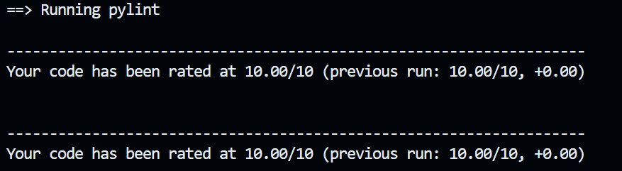
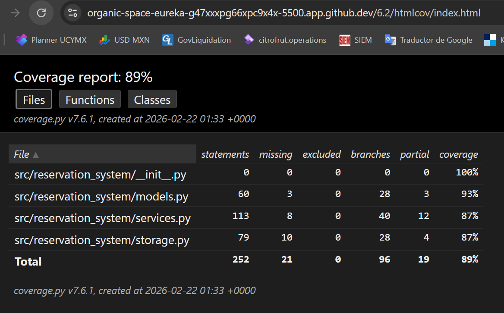
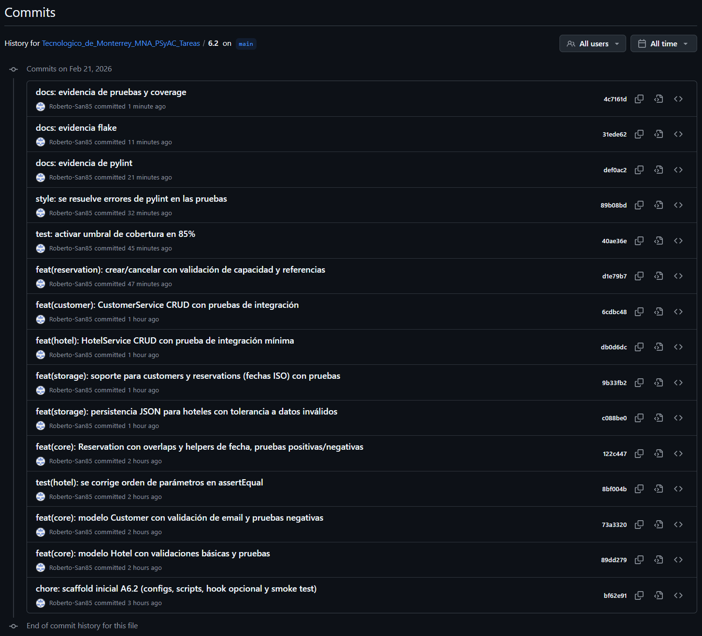

# Actividad 6.2 – Sistema de Reservaciones

Este proyecto se construye paso a paso, con buenas prácticas de commits, pruebas unitarias,
cobertura y analizadores estáticos (Flake8 y Pylint).

## Criterios de Evaluación y Evidencia

### 1. Análisis de Errores de Pylint – PEP 8
Evidencia:

### 2. Análisis de Errores de Flake
Evidencia:

### 3. Correcto Diseño de Casos de Prueba. Incluir casos negativos

#### 3.1) Modelos (`models.py`)

##### Hotel
- **Positivos**
  - Crear un hotel válido con `name="Hotel Test"` y `total_rooms=3` → se genera `id`, se respetan atributos.
- **Negativos**
  - Crear hotel con `name` vacío → `ValueError` (“Hotel.name no puede estar vacío”).
  - Crear hotel con `total_rooms <= 0` → `ValueError` (“Hotel.total_rooms debe ser > 0”).

##### Customer
- **Positivos**
  - Crear un cliente válido `name="Alice"`, `email="alice@example.com"` → se genera `id`, email en formato válido.
- **Negativos**
  - `name` vacío → `ValueError`.
  - `email` no válido (e.g., `"not-an-email"`) → `ValueError`.

##### Reservation
- **Positivos**
  - Crear reservación con rango válido `check_in < check_out`.
  - Verificar `overlaps()`:
    - Traslape verdadero (ej. `10–11` vs `10–12`) → `True`.
    - Sin traslape (ej. `10–11` vs `11–12`) → `False`.
- **Negativos**
  - `check_in >= check_out` → `ValueError`.
  - `customer_id` vacío → `ValueError`.
  - `hotel_id` vacío → `ValueError`.
  - Helper de fechas:
    - `date_from_iso("2024/02/29")` (formato incorrecto) → `ValueError`.

---

#### 3.2) Persistencia / Almacenamiento (`storage.py` con `JsonStorage`)

##### Hoteles
- **Positivos**
  - Crear archivos vacíos si no existen (`hotels.json`).
  - Guardar y cargar lista de hoteles correctamente.
- **Negativos**
  - Archivo `hotels.json` **corrupto** (p. ej. `{ this is not json }`) → se **tolera** y retorna `[]`; se **loggea** el error y **no se rompe la ejecución**.
  - Estructura JSON **no** lista → se ignora contenido, se loggea y se retorna `[]`.
  - Objetos incompletos/malformados en el arreglo (p. ej. falta `name` o `total_rooms`) → se **omiten** y se loggea.

##### Clientes
- **Positivos**
  - Guardar y cargar lista de clientes correctamente.
- **Negativos**
  - Archivo `customers.json` corrupto o con objetos malformados → se tolera/omite y se loggea, sin romper ejecución.

##### Reservaciones
- **Positivos**
  - Guardar y cargar lista de reservaciones convirtiendo `check_in/check_out` a/desde ISO (`YYYY-MM-DD`).
- **Negativos**
  - Archivo `reservations.json` corrupto o con objetos malformados (fechas inválidas, campos faltantes) → se tolera/omite y se loggea.

> **Nota de robustez:** Todas las cargas usan un lector seguro que:
> - Retorna `[]` ante JSON corrupto/estructura inesperada.
> - Omite entradas inválidas individuales sin detener el proceso.
> - Registra los errores en consola (logging).

---

#### 3.3) Servicios / Lógica de Negocio (`services.py`)

##### HotelService (CRUD)
- **Positivos**
  - `create(name, total_rooms)` crea y persiste.
  - `get(hotel_id)` retorna el hotel correcto.
  - `update(hotel_id, name, total_rooms)` actualiza datos válidos.
  - `delete(hotel_id)` elimina el hotel (en integración también limpia reservaciones relacionadas).
- **Negativos**
  - `update(hotel_id_inexistente, ...)` → retorna `None` (no lanza excepción).
  - `delete(hotel_id_inexistente)` → retorna `False`.

##### CustomerService (CRUD)
- **Positivos**
  - `create(name, email)` crea y persiste.
  - `get(customer_id)` retorna el cliente correcto.
  - `update(customer_id, name/email)` actualiza datos válidos.
  - `delete(customer_id)` elimina el cliente (en integración limpia reservaciones relacionadas).
- **Negativos**
  - `update(customer_id_inexistente, ...)` → retorna `None`.
  - `delete(customer_id_inexistente)` → retorna `False`.

##### ReservationService (Crear/Cancelar/Consultar)
- **Positivos**
  - `create(customer_id, hotel_id, check_in, check_out)` crea la reservación cuando:
    - El **cliente** existe.
    - El **hotel** existe.
    - **Hay capacidad** en el rango (con conteo de traslapes).
  - `get(reservation_id)` retorna la reservación correcta.
  - `cancel(reservation_id)`:
    - Primera cancelación → `True`.
    - Segunda cancelación (ya no existe) → `False`.
- **Negativos**
  - `create` con **cliente inexistente** → `ValueError` (“Cliente no existe”).
  - `create` con **hotel inexistente** → `ValueError` (“Hotel no existe”).
  - `create` que **excede capacidad** (traslapes >= `hotel.total_rooms`) → `ValueError` (“No hay habitaciones…”).

---

#### 3.4) Integración (Flujos end-to-end)

- **Positivos**
  - CRUD de hotel → crear, leer, actualizar, borrar y confirmar que ya no se obtiene.
  - CRUD de cliente → crear, leer, actualizar, borrar y confirmar que ya no se obtiene.
  - Reservación → crear, consultar, cancelar; segunda cancelación retorna `False`.
- **Negativos**
  - Crear reservación con **cliente inexistente** → `ValueError`.
  - Crear reservación cuando **no hay capacidad** (traslapes) → `ValueError`.

---

#### 3.5) Casos Negativos Mínimos (Resumen)

Se cubren **al menos** los siguientes **casos negativos** (≥5 solicitados por la rúbrica):

1. **Hotel** con `name` vacío y/o `total_rooms <= 0` → `ValueError`.  
2. **Customer** con `name` vacío o `email` inválido → `ValueError`.  
3. **Reservation** con `check_in >= check_out` → `ValueError`.  
4. **JSON corrupto** y **objetos malformados** en archivos → se toleran/omiten y se loggean sin romper ejecución.  
5. **Capacidad excedida** por traslape de reservaciones → `ValueError`.  
6. **Referencias inexistentes** (cliente/hotel) al crear reserva → `ValueError`.  
7. **Cancelación doble** de reservación (segunda vez) → `False` (no excepción).  
8. `update/delete` con IDs inexistentes en servicios → retornos seguros (`None`/`False`).  
9. Formato de fecha inválido en helper (`"2024/02/29"`) → `ValueError`.

### 4. Cobertura de líneas por clase
Evidencia:

### 5. Commits convencionales
Evidencia:

